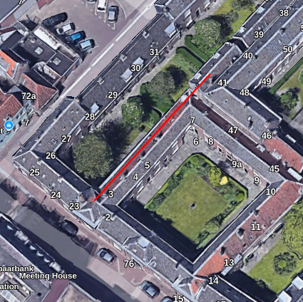
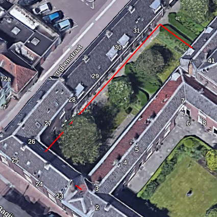

Intro
---

This repo contains a Rust/C-interop wrapper around Valhalla's `ways.bin`, `way_nodes.bin`, and `nodes.bin` files. The business logic is written in Rust, but the actual reading/writing/updating of the structs used by Valhalla (`OSMWay`, `OSMWayNode`, and `OSMNode`) is done in C. Since that code is compiled by a C compiler we don't have to worry about allignment and padding and we can easily use bitfields. This way we assure the memory layout is exactly like Valhalla expects it.

How to use
---

1. Clone this repo
1. Clone Valhalla
1. Optional: checkout Valhalla repo hash `d825888825b3a296881a23c5de435a3c08723702`
1. Remove the lines deleting the temporary files: https://github.com/valhalla/valhalla/blob/d825888825b3a296881a23c5de435a3c08723702/src/mjolnir/util.cc#L461-L473
1. Build valhalla
1. Setup valhalla as usual, using the OSM map `dordt.osm.pbf`
1. Plan a route from (51.81244720000001,4.669195900000005) to (51.81221930000001,4.668893200000014)
1. Note it is a short straight line following "Regentenhof")
1. Terminate valhalla
1. Update the path to the generated `way_nodes.bin` file in this repository in the function `override_shape_point`
1. `cargo run`
1. Hard-code the path in the `ConstructEdges` function: https://github.com/valhalla/valhalla/blob/d825888825b3a296881a23c5de435a3c08723702/src/mjolnir/graphbuilder.cc#L154 . Modify the `way_nodes_file` variable (you will have to make the string a regular `string` variable instead of `const string &`, so we can change it directly in the source.
1. Rebuild/setup valhalla
1. Plan the same route ((51.81244720000001,4.669195900000005) to (51.81221930000001,4.668893200000014))
1. Check the output, the route no longer follows the street, instead the middle of the route is move a bit more to the north-west

Images
---

Normal:

Hacked:

